<div align="center">

# 🚀 Production Ready Docker Platform

### Enterprise Microservices Platform with **Docker • Traefik • MySQL High Availability • Monitoring • Security • Observability**

<p align="center">


</p>

Production-grade Docker platform built from scratch using a modern microservices architecture featuring dynamic routing, automatic MySQL failover, GTID replication, centralized logging, observability, automated backups, API security, monitoring, alerting and production-ready infrastructure.

</div>

---

# 📑 Table of Contents

- Project Overview
- Production Architecture
- Architecture Evolution
- Enterprise Features
- Technology Stack
- Project Structure
- Networking
- Infrastructure
- Application High Availability
- Database High Availability
- Security Layer
- Monitoring Stack
- Logging Stack
- Backup & Restore
- Production Validation
- Screenshots
- Getting Started
- Roadmap

---

# 🌟 Project Overview

This project demonstrates how a modern production-ready containerized platform can be designed using Docker Compose.

Instead of deploying a single application, the platform consists of multiple production services working together using a cloud-native architecture.

The platform focuses on:

- Reverse Proxy
- Microservices
- Application High Availability
- Database High Availability
- GTID Replication
- Automatic Database Failover
- Automatic Replica Rejoin
- Dynamic HAProxy Routing
- API Security
- HTTPS
- Monitoring
- Alerting
- Centralized Logging
- Automated Backups
- Persistent Storage
- Production Networking

---

# 🏗 Production Architecture

The platform architecture consists of four major layers:

- Edge Layer (Traefik)
- Application Layer (Microservices)
- Data Layer (MySQL HA + Redis)
- Observability Layer (Prometheus + Grafana + Loki)

<br>

<p align="center">

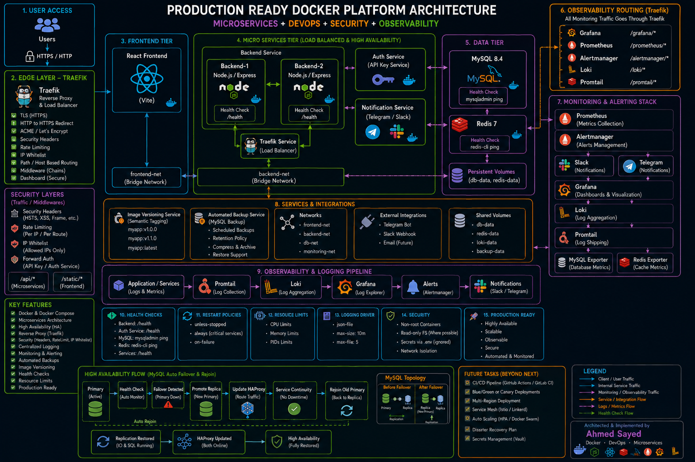

</p>

---

# 🏗 Architecture Evolution

The project originally started with a classic Nginx-based architecture before evolving into the final enterprise architecture using Traefik, HAProxy and an automated MySQL High Availability layer.

The final architecture now supports:

- Dynamic Reverse Proxy
- Backend Load Balancing
- GTID Replication
- Automatic Primary Promotion
- Automatic Replica Rejoin
- Dynamic HAProxy Configuration
- Automatic Database Failover

<p align="center">

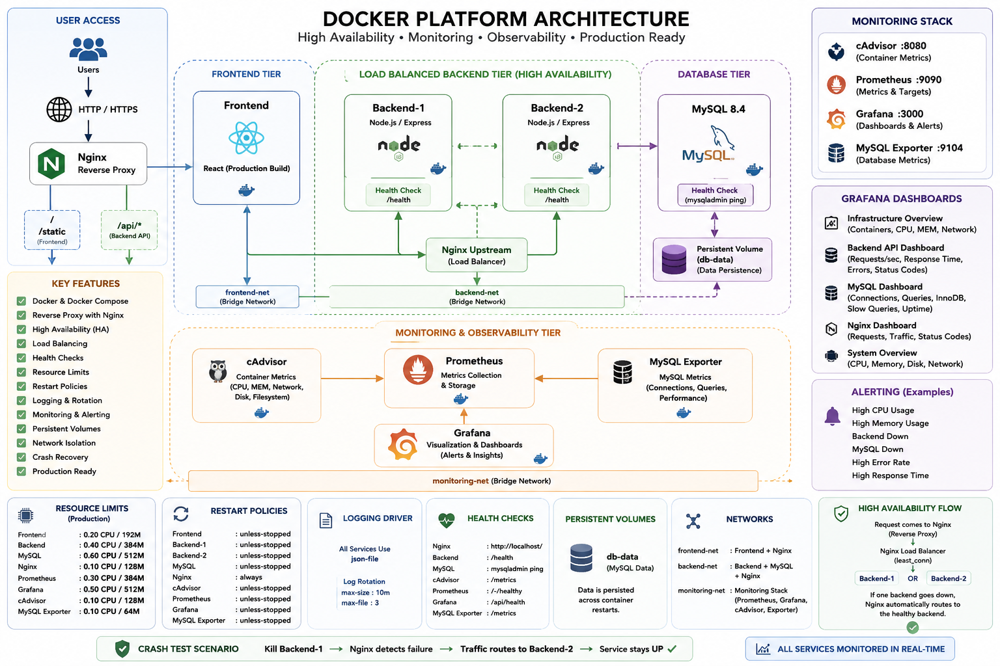

</p>

---

# ⚡ Enterprise Features

## Reverse Proxy

- Traefik Reverse Proxy
- Automatic HTTPS Redirect
- Host Based Routing
- Path Based Routing
- Dashboard
- Middleware Chains

---

## Load Balancing

### Application Layer

- Two Backend Replicas
- Automatic Traffic Distribution
- Health Based Routing
- Zero Manual Switching

### Database Layer

- MySQL Primary / Replica Architecture
- Automatic Primary Promotion
- Automatic Replica Rejoin
- Dynamic HAProxy Backend Switching
- Automatic HAProxy Configuration Regeneration
- Automatic Router Reload

---

## Security

- HTTPS
- TLS Certificates
- Security Headers
- API Key Authentication
- Rate Limiting
- IP Whitelist
- Internal APIs Protection

---

## Monitoring

- Prometheus
- Grafana
- Alertmanager
- MySQL Exporter
- Redis Exporter
- cAdvisor

---

## Centralized Logging

- Loki
- Promtail
- Container Logs
- Searchable Logs
- Dashboard Integration

---

## Notifications

- Telegram
- Slack
- Alertmanager Integration

---

## Database

- MySQL 8.4
- Primary / Replica Architecture
- GTID Replication
- Automatic Primary Promotion
- Automatic Replica Rejoin
- Dynamic HAProxy Backend Switching
- Automatic Configuration Regeneration
- Persistent Volumes
- Automated Backups
- Restore Script

---

## Docker Features

- Docker Compose
- Custom Networks
- Named Volumes
- Restart Policies
- Resource Limits
- Health Checks

---

# 🧰 Technology Stack

| Layer | Technology |
|---------|------------|
| Frontend | React + Vite |
| Backend | Node.js + Express |
| Reverse Proxy | Traefik |
| Database Router | HAProxy |
| Database | MySQL 8.4 |
| Replication | MySQL GTID Replication |
| Cache | Redis 7 |
| Monitoring | Prometheus |
| Dashboards | Grafana |
| Alerting | Alertmanager |
| Logging | Loki |
| Log Shipping | Promtail |
| Metrics | cAdvisor |
| Notifications | Telegram + Slack |
| Backup | Bash + mysqldump |
| Containerization | Docker Compose |

---

# 📂 Project Structure

```text
dockerized-microservices-platform/

├── frontend/
├── backend/
├── auth-service/
├── notification-service/
│
├── database/
│   ├── primary/
│   ├── replica/
│   ├── init/
│   ├── scripts/
│   ├── failover/
│   ├── haproxy/
│   └── state/
│
├── monitoring/
├── prometheus/
├── grafana/
├── loki/
├── promtail/
├── traefik/
│
├── ops/
│   └── mysql-backup/
│
├── screenshots/
│
├── docker-compose.yml
├── docker-compose.prod.yml
├── README.md
└── LICENSE
```

---

# 🌐 Docker Networks

The platform uses multiple isolated bridge networks.

| Network | Purpose |
|----------|----------|
| frontend-net | Frontend Communication |
| backend-net | Backend Communication |
| monitoring-net | Monitoring Stack |

This separation improves security and network isolation.

```
docker network ls
```


---

# 💾 Persistent Volumes

Persistent Docker volumes are used to preserve important data.

- MySQL Database
- Redis
- Grafana
- Loki
- Telegram Bot
- Database Backups

<p align="center">
  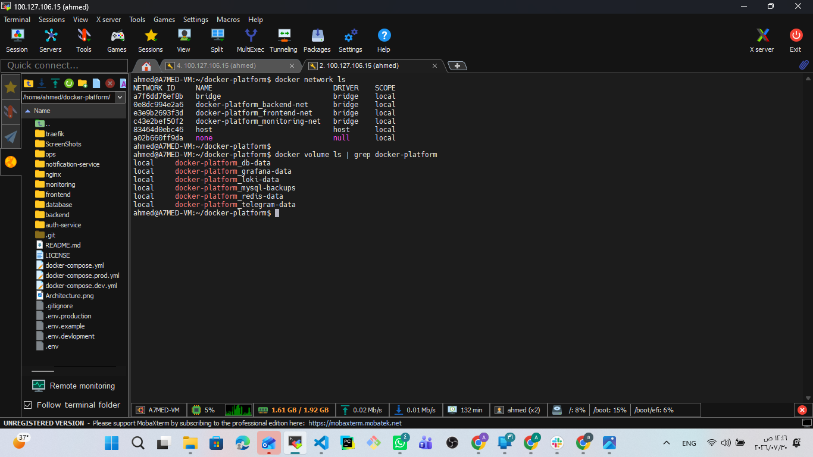
</p>


---

# 🐳 Docker Images

The project builds custom images for all internal services.

- Frontend
- Backend
- Auth Service
- Notification Service
- MySQL Backup

<p align="center">
  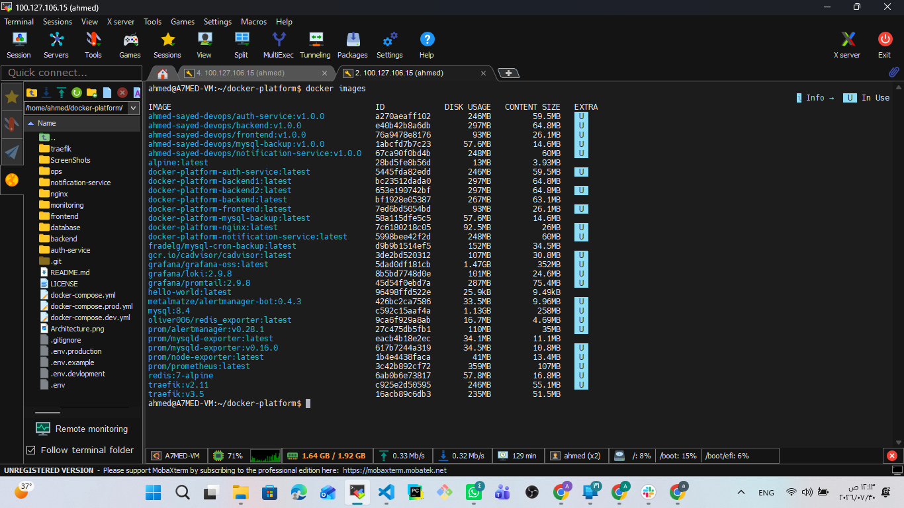
</p>

---


# 🌍 Edge Layer (Traefik)

Traefik acts as the entry point for the entire platform and is responsible for routing, security, HTTPS termination and load balancing.

### Responsibilities

- Reverse Proxy
- HTTPS Termination
- Automatic HTTP → HTTPS Redirect
- Path Based Routing
- Middleware Chaining
- Load Balancing
- Health-aware Routing
- API Protection

---

## Traefik Dashboard

https://traefik.local/dashboard/

The dashboard provides complete visibility into routers, services and middlewares.

<p align="center">
  
</p>


---

## Routers

Traefik routes incoming requests based on URL paths.

### Public Routes

| Route | Destination |
|--------|-------------|
| / | React Frontend |
| /api/* | Backend API |
| /grafana/* | Grafana |
| /prometheus/* | Prometheus |
| /alertmanager/* | Alertmanager |
| /loki/* | Loki |

### Internal Routes

Internal APIs are protected using Forward Authentication.

<p align="center">
  
</p>

---

## Services

Traefik automatically discovers Docker services and performs load balancing.

Features:

- Dynamic Service Discovery
- Multiple Backend Replicas
- Automatic Health Detection

<p align="center">
  
</p>

---

## Middlewares

Multiple middleware chains are used to secure the platform.

### Public Chain

- Security Headers
- Rate Limiting

### Internal Chain

- Security Headers
- Rate Limiting
- API Authentication

<p align="center">
  
</p>

---

# 🔐 Security Layer

Security was implemented as a first-class component rather than an afterthought.

The platform includes multiple protection mechanisms against common attacks.

---

## HTTPS

All client traffic is encrypted using TLS.

Features

- HTTPS
- TLS
- Secure EntryPoint
- Encrypted Traffic

<p align="center">
  
</p>

---

## Automatic HTTP Redirect

All HTTP traffic is automatically redirected to HTTPS.

This guarantees encrypted communication.

**Screenshot**

```
screenshots/31-HTTP to HTTPS Automatic Redirection.png
```

---

## Security Headers

Traefik injects security headers into every request.

Examples include:

- HSTS
- XSS Protection
- Content Type Protection
- Frame Protection
- Referrer Policy

Internal Middleware

<p align="center">
  
</p>

Public Middleware

<p align="center">
  
</p>

---

## API Authentication

Internal APIs require a valid API Key.

Without the key, requests are rejected.

Verification

<p align="center">
  
</p>

---

## IP Whitelist

Sensitive endpoints can only be accessed from approved IP addresses.

Authorized Client

<p align="center">
  
</p>

Blocked Client

<p align="center">
  
</p>

<p align="center">
  
</p>

---

## Rate Limiting

Traefik protects APIs from excessive requests.

Configuration

- Average: 10 Requests/sec
- Burst: 20 Requests
- Period: 1 Second

Middleware

<p align="center">
  
</p>


Validation

<p align="center">
  
</p>


---

# ⚖️ High Availability

The platform implements high availability at two different layers:

- Application High Availability using Traefik Load Balancer.
- Database High Availability using MySQL GTID Replication and HAProxy.

This architecture ensures that both the application and the database remain available even if one of the nodes becomes unavailable.

---

# 🌐 Application High Availability

Traefik distributes incoming traffic across multiple backend replicas.

Benefits

- Zero Manual Routing
- Automatic Load Balancing
- Health-Based Routing
- Fault Tolerance
- Horizontal Scaling

---

## Backend Replica 1

<p align="center">
  
</p>

---

## Backend Replica 2

<p align="center">
  
</p>

---

# 🗄️ Database High Availability

The database layer is designed using a **Primary / Replica** architecture powered by MySQL GTID Replication.

Instead of relying on manual intervention, the platform continuously monitors database health and automatically reacts to failures.

### Features

- MySQL Primary / Replica Architecture
- GTID Based Replication
- Automatic Primary Promotion
- Automatic Replica Rejoin
- Dynamic HAProxy Backend Switching
- Automatic HAProxy Configuration Regeneration
- Automatic Router Reload
- Zero Manual Database Recovery

---

## Initial Cluster State

Initially, one MySQL instance acts as the writable Primary while the second instance operates as a read-only Replica.

The active primary is tracked automatically using the shared state file.

<p align="center">
  
</p>

---

## Replication Validation

GTID Replication continuously synchronizes data from the Primary to the Replica.

The replication health is verified using MySQL replication status.

<p align="center">
  
</p>

---

## Automatic Database Failover

If the Primary database becomes unavailable:

1. The failure is detected automatically.
2. The Replica is promoted to become the new Primary.
3. Read-only mode is disabled.
4. The shared state file is updated.
5. HAProxy regenerates its configuration.
6. Traffic is redirected automatically to the new Primary.

No manual intervention is required.

<p align="center">
  
</p>

---

## Dynamic HAProxy Routing

After every promotion or failback, HAProxy regenerates its backend configuration dynamically.

Instead of using a static backend, HAProxy always routes write traffic to the current writable Primary.

<p align="center">
  
</p>

---

## Automatic Replica Rejoin

When the failed server comes back online:

- Replication is recreated automatically.
- GTID synchronization resumes.
- Read-only mode is enabled again.
- The server becomes the Replica without any manual SQL commands.

<p align="center">
  
</p>

---

## Zero Downtime Validation

After the automatic failover process completes, the application continues serving requests normally.

No application configuration changes are required.

<p align="center">
  
</p>

---

## Automatic Failback Validation

If the active Primary fails later, the remaining healthy server is promoted automatically once again.

HAProxy updates its routing dynamically and client traffic continues without manual switching.

<p align="center">
  
</p>

---

## Database High Availability Summary

| Feature | Status |
|---------|--------|
| GTID Replication | ✅ |
| Automatic Failover | ✅ |
| Automatic Primary Promotion | ✅ |
| Automatic Replica Rejoin | ✅ |
| Dynamic HAProxy Routing | ✅ |
| Automatic HAProxy Configuration | ✅ |
| Automatic Router Restart | ✅ |
| Read / Write Separation | ✅ |
| Zero Manual Recovery | ✅ |
| Failback Validation | ✅ |

---

# 📊 Monitoring & Observability

The platform provides complete visibility into infrastructure and application health.

Monitoring Components

- Prometheus
- Grafana
- Alertmanager
- cAdvisor
- MySQL Exporter
- Redis Exporter

---

## Prometheus Targets

Prometheus continuously scrapes metrics from all monitored services.

Healthy Targets

<p align="center">
  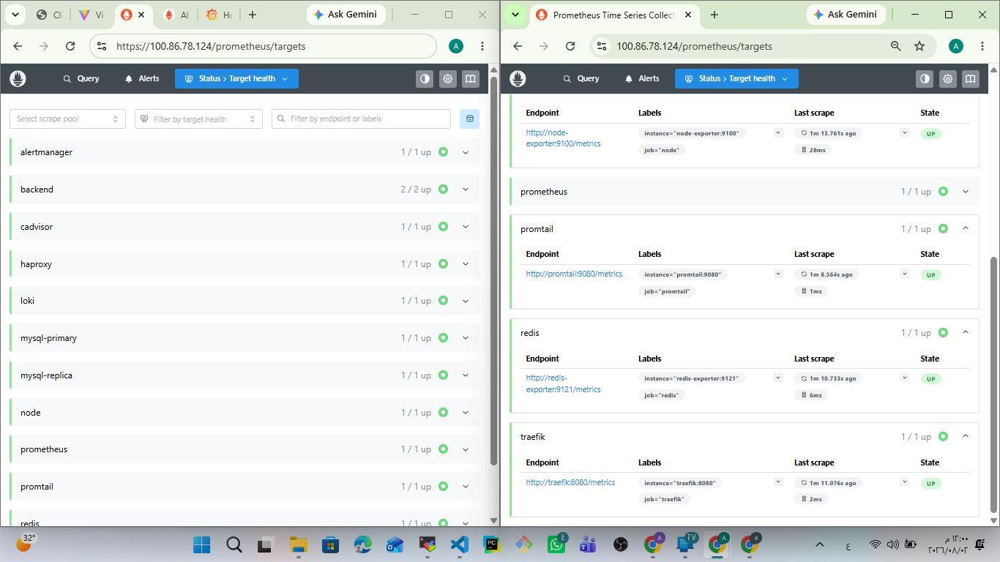
</p>

---

## Failure Detection

Prometheus instantly detects unavailable services.

Example

<p align="center">
  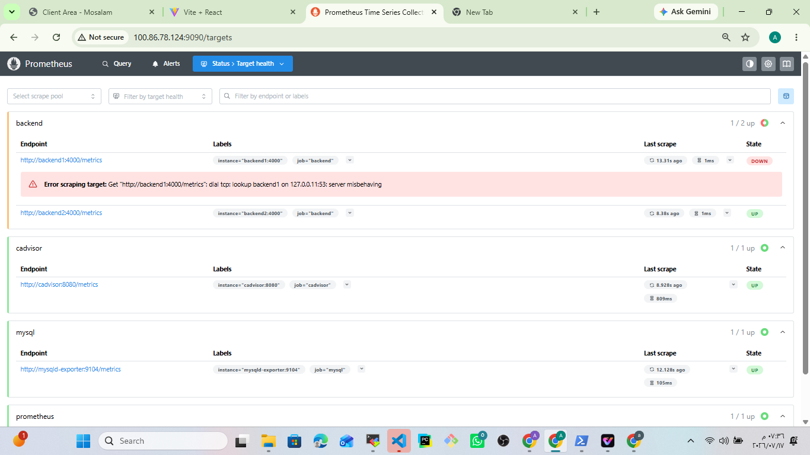
</p>

---

## Prometheus Alerts

Alert rules continuously evaluate system health.

Examples

- Backend Down
- Grafana Down
- High Memory
- High CPU
- Disk Usage

**Screenshot**

<p align="center">
  
</p>

---

## Grafana Dashboards

Grafana visualizes infrastructure metrics in real time.

Dashboards include

- Infrastructure
- Containers
- Services
- Databases
- Logs

Application Dashboard

<p align="center">
  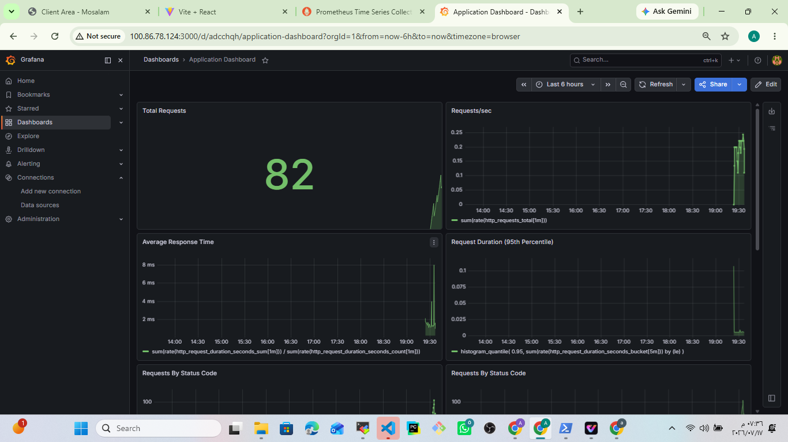
</p>

Infrastructure Dashboard

<p align="center">
  
</p>

---

## cAdvisor

Container metrics include

- CPU
- Memory
- Filesystem
- Network

Dashboard

<p align="center">
  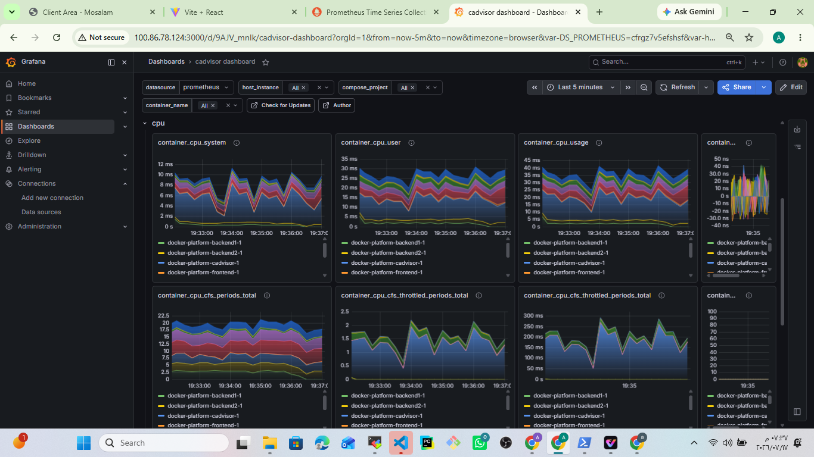
</p>

```
screenshots/14-cadvisor-dashboard.png
```

```
screenshots/15-cadvisor-dashboard.png
```

---

## MySQL Dashboard

Database metrics include

- Connections
- Queries
- InnoDB
- Performance

<p align="center">
  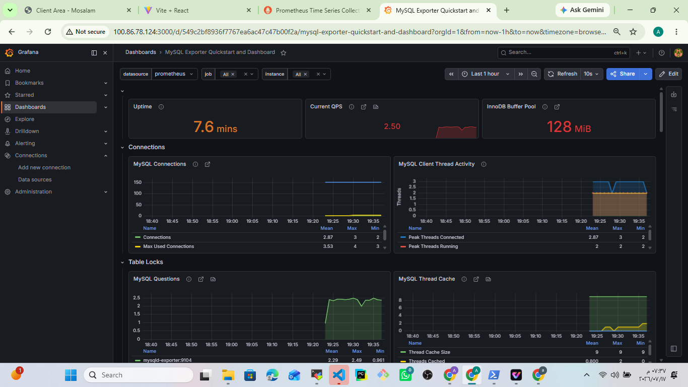
</p>

```
screenshots/17-mysql-dashboard-2.png
```

```
screenshots/18-mysql-dashboard-3.png
```

---


# 📜 Centralized Logging

Modern production systems require centralized log aggregation instead of checking each container individually.

This platform uses:

- Promtail
- Loki
- Grafana Explore
- Docker JSON Logging Driver

Benefits

- Centralized logs
- Fast searching
- Container filtering
- Historical logs
- Real-time log streaming

---

## Grafana Explore

Logs from every container can be queried directly inside Grafana.

<p align="center">
  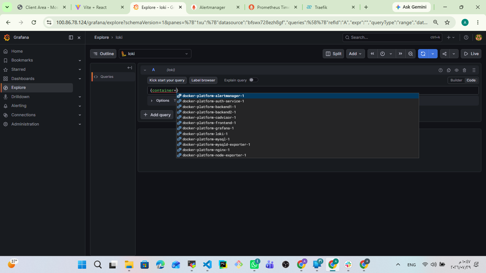
</p>

---

## Loki Query

Container logs are filtered using labels.

Example

```
{container="docker-platform-backend1-1"}
```

<p align="center">
  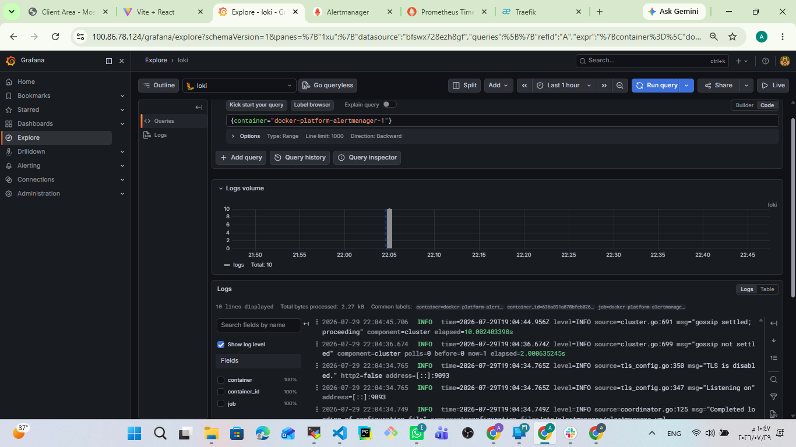
</p>

---

## Backend Container Logs

Real-time backend logs collected by Loki.


<p align="center">
  
</p>

```
screenshots/50-Grafana Container Logs 2.png
```

```
screenshots/51-Grafana Container Logs 3.png
```

<p align="center">
  
</p>

<p align="center">
  
</p>

---

# 🚨 Alerting

Prometheus continuously evaluates alert rules.

Whenever a rule is triggered:

Prometheus

↓

Alertmanager

↓

Notification Service

↓

Slack & Telegram

---

## Alertmanager

Alertmanager receives alerts from Prometheus before forwarding notifications.

<p align="center">
  
</p>


---

## Slack Notifications

Production alerts are delivered instantly to Slack.

Example

- Grafana Down
- Backend Down
- High CPU
- High Memory

<p align="center">
  
</p>

---

## Telegram Notifications

Telegram provides instant mobile notifications.

<p align="center">
  
</p>

---

# 💾 Automated Backup & Restore

The platform includes a dedicated MySQL backup service.

Features

- Scheduled Backups
- Gzip Compression
- Retention Policy
- Restore Script
- Persistent Storage

---

## Backup Files

Automatically generated database backups.

<p align="center">
  
</p>

---

## Backup Validation

To verify the restore process, a table was intentionally deleted.


<p align="center">
  
</p>

---

## Restore Validation

The latest backup was restored successfully.

<p align="center">
  
</p>

---

# ❤️ Health Checks

Every critical service implements health checks.

Examples

- Backend

```
/health
```

- MySQL

```
mysqladmin ping
```

- Redis

```
redis-cli ping
```

Benefits

- Automatic failure detection
- Healthy routing
- Reliable deployments

---

# 🔄 Restart Policies

Different restart policies are configured depending on service criticality.

Examples

- unless-stopped
- always
- on-failure

Validation

<p align="center">
  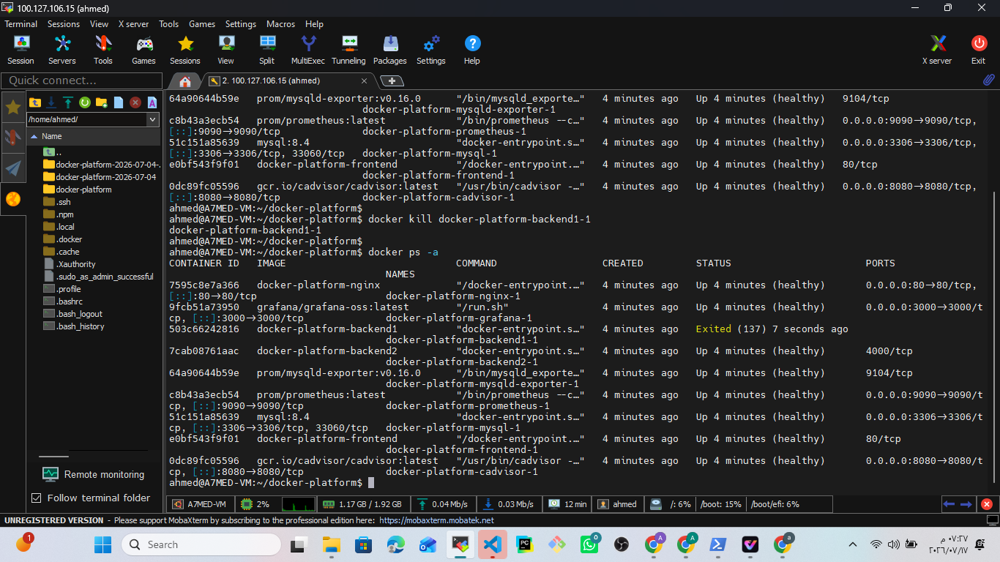
</p>


<p align="center">
  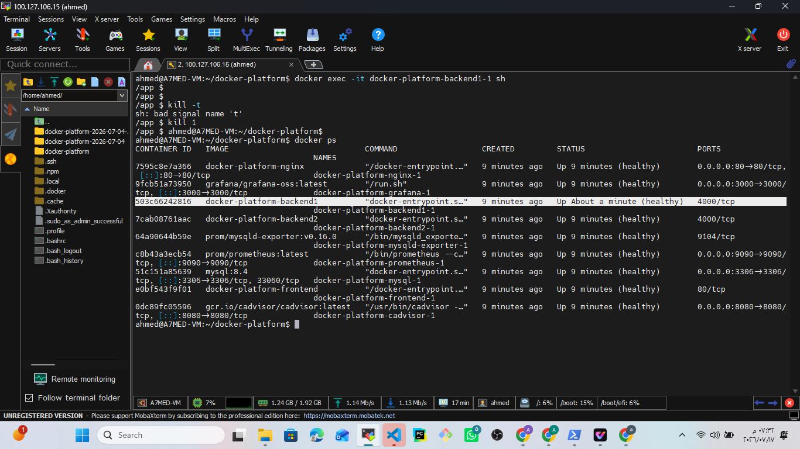
</p>

---

# 📈 Production Validation

The following production scenarios were successfully validated.

| Validation | Status |
|------------|--------|
| Docker Compose Deployment | ✅ |
| Multi-Service Deployment | ✅ |
| Reverse Proxy | ✅ |
| HTTPS | ✅ |
| HTTP → HTTPS Redirect | ✅ |
| Security Headers | ✅ |
| API Authentication | ✅ |
| Rate Limiting | ✅ |
| IP Whitelist | ✅ |
| Backend Load Balancing | ✅ |
| Backend High Availability | ✅ |
| MySQL GTID Replication | ✅ |
| Automatic Database Failover | ✅ |
| Automatic Primary Promotion | ✅ |
| Automatic Replica Rejoin | ✅ |
| Dynamic HAProxy Routing | ✅ |
| Automatic HAProxy Configuration | ✅ |
| Automatic Router Reload | ✅ |
| Zero Manual Database Recovery | ✅ |
| Health Checks | ✅ |
| Monitoring | ✅ |
| Grafana Dashboards | ✅ |
| Prometheus Metrics | ✅ |
| Alertmanager | ✅ |
| Slack Notifications | ✅ |
| Telegram Notifications | ✅ |
| Loki Logging | ✅ |
| Automated Backup | ✅ |
| Restore Validation | ✅ |
| Persistent Volumes | ✅ |
| Docker Networks | ✅ |
| Restart Policies | ✅ |

---

# 📦 Docker Infrastructure

## Running Containers

<p align="center">
  
</p>

<p align="center">
  
</p>

---

## Docker Images

The platform is composed of multiple custom-built images and production services.

<p align="center">
  
</p>

---

## Docker Networks & Volumes

Dedicated bridge networks and persistent volumes provide service isolation and durable storage.

<p align="center">
  
</p>

---

# 🚀 Getting Started

Clone the repository

```bash
git clone https://github.com/ahmed-sayed-devops/dockerized-microservices-platform.git

cd dockerized-microservices-platform
```

Build and start the complete production platform

```bash
docker compose -f docker-compose.yml -f docker-compose.prod.yml up -d --build
```

Check running containers

```bash
docker ps
```

View logs

```bash
docker compose logs -f
```

Stop the platform

```bash
docker compose down
```

---

# 📊 Platform Components

| Component | Purpose |
|------------|---------|
| Traefik | Reverse Proxy & Load Balancer |
| React | Frontend |
| Backend-1 | API Service |
| Backend-2 | API Service |
| Auth Service | API Authentication |
| Notification Service | Slack & Telegram Notifications |
| HAProxy | MySQL Database Router |
| MySQL Primary | Read / Write Database |
| MySQL Replica | High Availability Replica |
| Auto Failover Service | Primary Promotion |
| Auto Rejoin Service | Replica Recovery |
| Redis | Cache |
| Prometheus | Metrics Collection |
| Grafana | Dashboards |
| Alertmanager | Alert Routing |
| Loki | Log Aggregation |
| Promtail | Log Shipping |

---

# 🎯 Key Achievements

- Enterprise Microservices Architecture
- Production Ready Docker Platform
- Traefik Reverse Proxy
- Backend Load Balancing
- MySQL High Availability
- GTID Replication
- Automatic Database Failover
- Automatic Primary Promotion
- Automatic Replica Rejoin
- Dynamic HAProxy Routing
- Automatic Database Recovery
- HTTPS Everywhere
- API Authentication
- Rate Limiting
- IP Whitelist
- Security Headers
- Monitoring Stack
- Alerting Stack
- Centralized Logging
- Automated Database Backup
- Restore Validation
- Persistent Storage
- Container Health Checks
- Docker Networking
- Resource Isolation
- Enterprise Observability

---

# 🛣️ Future Improvements

The following enhancements are planned for future versions:

- ProxySQL Integration
- Read / Write Query Splitting
- Multi-Replica MySQL Cluster
- GitHub Actions CI/CD Pipeline
- Blue / Green Deployment
- Canary Deployment
- Kubernetes Deployment
- Docker Swarm Support
- Multi-Region Deployment
- Auto Scaling
- Secret Management (Vault)
- Distributed Tracing (Jaeger)
- Service Mesh (Istio)

---

# 📄 License

This project is licensed under the MIT License.

---

# 👨‍💻 Author

<div align="center">

## Ahmed Sayed

**DevOps Engineer | Cloud Engineer | Docker | AWS | Linux | Kubernetes**

GitHub

https://github.com/ahmed-sayed-devops

LinkedIn

https://linkedin.com/in/ahmed-sayed-devops

⭐ If you found this project useful, consider giving it a Star.

</div>
